<!--
Fuente del PDF de entrega. Generar el PDF desde este archivo (VS Code "Markdown PDF" o pandoc)
y nombrarlo igual que la carpeta de Drive: DSWB_2<<COMISIÓN>>_<<NOMBRE>>_2C26
Antes de exportar: reemplazar todos los <<COMPLETAR>>.
-->

# DOCUMENTACIÓN - Parte 1

**Desarrollo de Sistemas Web (Back End) — 2° cuatrimestre 2026**

**Caso #<<COMPLETAR>>: FreshRoute B2B — Logística de distribución refrigerada**

**Empresa de Desarrollo: LosBuleanos**

**Integrantes:**

- Nicolás Zalazar
- Laura Olivera
- Christian Albornoz
- Belén Lau
- Fernando Guevara

**Nombre del documento / carpeta Drive:** `DSWB_2<<COMPLETAR>>_<<COMPLETAR>>_2C26`

---

## 1. Links

| Recurso | Link |
|---|---|
| Carpeta Drive (`Primera Entrega`) | <<COMPLETAR>> |
| Repositorio GitHub | https://github.com/Nicoalazar/PrimerParcialDSWB |
| Video de presentación | <<COMPLETAR>> |

---

## 2. Bibliografía

**Material de la cátedra**

- Código de clases 1 a 4 (Drive del profesor) — https://drive.google.com/drive/folders/18hYfMEMIDmce3HxpmjJRqGdp9KBO9t9j

**Documentación**

- Express 5: routing, middleware, manejo de errores y guía de migración — https://expressjs.com/
- Node.js: módulos `fs` y `path` — https://nodejs.org/api/fs.html · https://nodejs.org/api/path.html
- Pug: referencia del lenguaje e integración con Express — https://pugjs.org/
- Postman: importar/exportar colecciones — https://learning.postman.com/docs/getting-started/importing-and-exporting/importing-and-exporting-overview/
- MDN: métodos HTTP y códigos de estado — https://developer.mozilla.org/es/docs/Web/HTTP/Status

**Videos**

- <<COMPLETAR: título — canal — link de YouTube>>

El detalle completo está en `docs/bibliografia.md` del repositorio.

---

## 3. Introducción

En esta primera instancia desarrollamos el backend de **FreshRoute B2B**, una empresa ficticia de logística de distribución refrigerada que reparte insumos a restaurantes, comedores escolares y cocinas industriales.

La aplicación está construida con **Node.js y Express 5** siguiendo el esquema **MVC**: las rutas (`routes/`) reciben el request, los controladores (`controllers/`) resuelven la lógica de cada endpoint, los modelos (`models/`) representan las entidades del dominio como clases, y las vistas (`views/`) renderizan la interfaz con **Pug**. La persistencia se resuelve con **archivos JSON** dentro de `/data`, leídos y escritos con el módulo `fs` a través de un repositorio genérico (`JsonRepository`).

Se implementaron **dos módulos funcionales con CRUD completo — Clientes y Pedidos —**, cada uno accesible por una API REST (probada con Postman) y por vistas web. Además se agregaron middlewares de logging, validación de datos y manejo centralizado de errores, y un servicio de negocio (`PedidoService`) que valida referencias entre entidades y controla las transiciones de estado de un pedido. Los choferes se cargan desde un seed de solo lectura y se usan como referencia al crear pedidos; su CRUD y la migración a MongoDB quedan para la segunda entrega.

---

## 4. Integrantes y responsabilidades

| Integrante | Responsabilidad | Sprints |
|---|---|---|
| Nicolás Zalazar | Estructura base del proyecto: `app.js`, configuración de Express y Pug, estructura MVC de carpetas y seed de choferes | 1 |
| Laura Olivera | `JsonRepository` genérico, Backend Clientes (model, controller, router) y vistas web de Clientes | 2, 6 |
| Christian Albornoz | Backend Pedidos (model, controller, router) + seed de choferes expuesto en `GET /api/choferes`, y vistas web de Pedidos | 3, 7 |
| Belén Lau | `PedidoService` (validación de cliente/chofer, transiciones de estado) y middlewares: logger, validación de body y manejo centralizado de errores / 404 | 4, 5 |
| Fernando Guevara | QA: code review cruzado, bug bash end-to-end, smoke test automatizado y corrección de bugs · documentación y evidencia | 8, 9 |

El trabajo se organizó en 10 sprints cortos (2 por día) con un GitHub Project, una rama por sprint y pull requests con revisión cruzada antes de integrar a `development` y luego a `main`.

---

## 5. Descripción funcional de la aplicación

### 5.1 Objetivo general

Centralizar la gestión de los pedidos de distribución refrigerada de FreshRoute: registrar los clientes a los que se reparte, cargar los pedidos con sus ítems, asignarlos a un chofer y seguir el avance de cada entrega a través de sus estados, garantizando que los datos sean consistentes (no se puede crear un pedido para un cliente o chofer inexistente ni saltear etapas de la entrega).

### 5.2 Funcionalidades principales actuales

- **ABM de clientes**: alta, listado, consulta por id, edición parcial y baja. Cada cliente tiene nombre, dirección, zona, contacto y horario de entrega.
- **ABM de pedidos**: alta, listado, consulta por id, edición parcial y baja. Cada pedido referencia a un cliente y a un chofer, tiene una lista de ítems (descripción + cantidad), una fecha/hora programada y un estado.
- **Ciclo de vida del pedido**: todo pedido nace en `pendiente` y solo puede avanzar de a un paso: `pendiente → asignado → en tránsito → entregado`. Las transiciones inválidas (saltos o retrocesos) se rechazan con `400`.
- **Validación de datos**: los `POST`/`PUT` de ambos módulos pasan por middlewares que verifican campos obligatorios y tipos, y responden `400 { mensaje, errores }` con el detalle de cada problema.
- **Integridad referencial**: al crear o editar un pedido se comprueba que el `clienteId` exista en `clientes.json` y el `choferId` en `choferes.json`.
- **Manejo de errores centralizado**: id inexistente → `404`, ruta no montada → `404 { mensaje: "Ruta no encontrada" }`, errores no previstos → `500`. Los controladores no llevan `try/catch`: Express 5 deriva los errores al `errorHandler`.
- **Logger**: cada request se registra en consola con timestamp, método y URL.
- **Interfaz web**: vistas Pug para navegar y operar ambos módulos desde el navegador (listados, formularios de alta/edición, detalle de pedido con botón "Avanzar estado"), reutilizando los mismos validadores y reglas de negocio que la API.
- **Consulta de choferes**: `GET /api/choferes` devuelve el seed de choferes para usarlo como referencia (dropdown) al armar un pedido.

---

## 6. Módulos del proyecto

### Módulo de Clientes

Listar, crear, editar y eliminar clientes.

| Método | Ruta | Descripción |
|---|---|---|
| `GET` | `/api/clientes` | Lista todos los clientes |
| `GET` | `/api/clientes/:id` | Devuelve un cliente por id (`404` si no existe) |
| `POST` | `/api/clientes` | Crea un cliente (`201`); valida los 5 campos obligatorios |
| `PUT` | `/api/clientes/:id` | Edición parcial de un cliente |
| `DELETE` | `/api/clientes/:id` | Elimina un cliente |

Vistas web en `/clientes`: listado, formulario de alta (`/clientes/nuevo`), formulario de edición (`/clientes/:id/editar`) y baja.

Archivos: `models/Cliente.js`, `controllers/clientesController.js`, `routes/api/clientesRoutes.js`, `routes/web/clientesRoutes.js`, `views/clientes/`.

### Módulo de Pedidos

Listar, crear, editar y eliminar pedidos; ver y cambiar su estado.

| Método | Ruta | Descripción |
|---|---|---|
| `GET` | `/api/pedidos` | Lista todos los pedidos |
| `GET` | `/api/pedidos/:id` | Devuelve un pedido por id (`404` si no existe) |
| `POST` | `/api/pedidos` | Crea un pedido en estado `pendiente` (`201`); valida ítems y existencia de cliente y chofer |
| `PUT` | `/api/pedidos/:id` | Edición parcial (cliente, chofer, ítems, fecha); el estado no se cambia por acá |
| `PATCH` | `/api/pedidos/:id/estado` | Avanza al estado siguiente; rechaza saltos y retrocesos con `400` |
| `DELETE` | `/api/pedidos/:id` | Elimina un pedido |
| `GET` | `/api/choferes` | Seed de choferes de solo lectura (referencia para asignar pedidos) |

Vistas web en `/pedidos`: listado con nombre de cliente y chofer, detalle con botón "Avanzar estado" (`/pedidos/:id`), formulario de alta con `select` de cliente y chofer (`/pedidos/nuevo`), edición y baja.

Archivos: `models/Pedido.js`, `controllers/pedidosController.js`, `services/PedidoService.js`, `routes/api/pedidosRoutes.js`, `routes/web/pedidosRoutes.js`, `views/pedidos/`.

### Componentes transversales

- `repositories/JsonRepository.js`: clase genérica con `getAll`, `getById`, `create`, `update` y `delete` sobre un archivo JSON. Genera el `id` internamente (`max(id) + 1`).
- `middlewares/logger.js`, `middlewares/validate.js`, `middlewares/errorHandler.js`.

### Próximos Módulos

- **Choferes (CRUD completo)**: hoy es un seed fijo de 4 registros; en la segunda entrega pasa a ser un módulo con alta, edición y baja, y con asignación de zona.
- **Migración a MongoDB**: reemplazar `JsonRepository` por modelos de Mongoose manteniendo las mismas rutas y controladores.
- Posibles extensiones del caso (fuera del alcance actual): autenticación de usuarios, historial de cambios de estado por pedido.

---

## 7. Persistencia de Datos

Los datos se guardan en archivos JSON dentro de la carpeta `/data/` del proyecto. Cada módulo instancia un `JsonRepository` con el nombre de su archivo y lee/escribe con `fs.readFileSync` / `fs.writeFileSync`.

| Archivo | Registros en el seed | Campos |
|---|---|---|
| `data/clientes.json` | 5 | `id`, `nombre`, `direccion`, `zona`, `contacto`, `horarioEntrega` |
| `data/pedidos.json` | 3 | `id`, `clienteId`, `choferId`, `items[{ descripcion, cantidad }]`, `estado`, `fechaHoraProgramada` |
| `data/choferes.json` | 4 | `id`, `nombre`, `apellido`, `vehiculo`, `zona` (solo lectura) |

El repositorio se entrega con el seed cargado, de modo que al clonar y ejecutar `npm install && npm run dev` la aplicación ya muestra datos desde el primer request.

### Capturas de Postman

Colección: `docs/api-collection.postman.json`. Capturas en `docs/evidencia/`.

**Módulo Clientes**

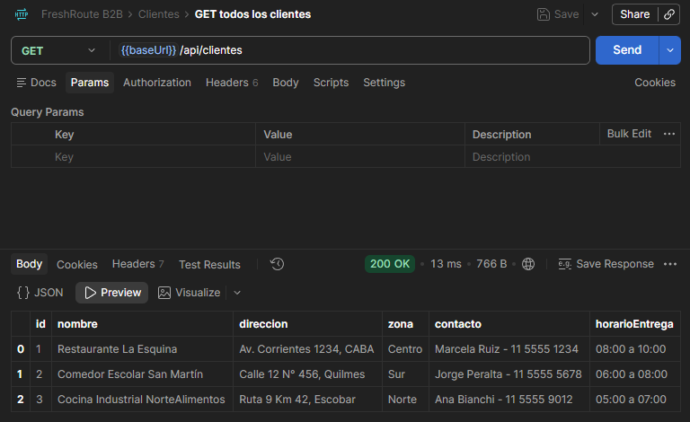

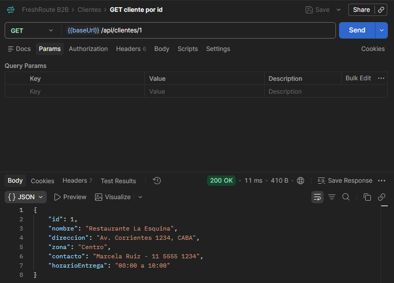

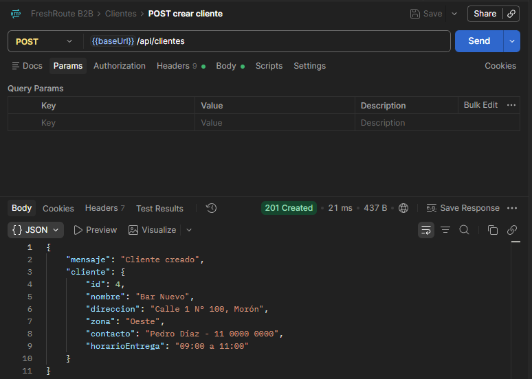

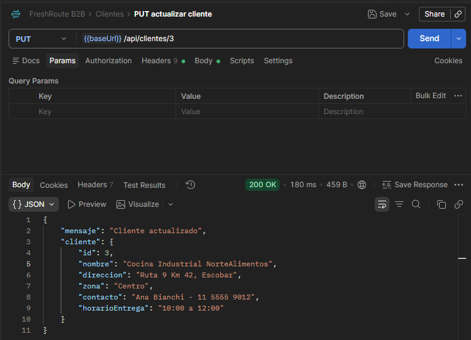

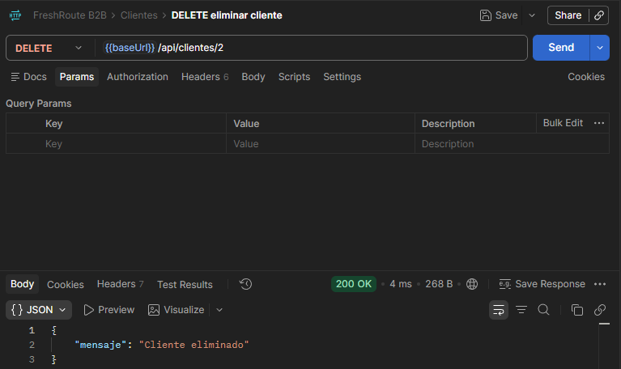

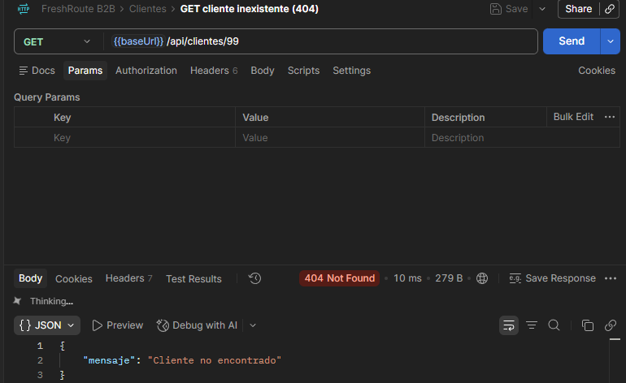

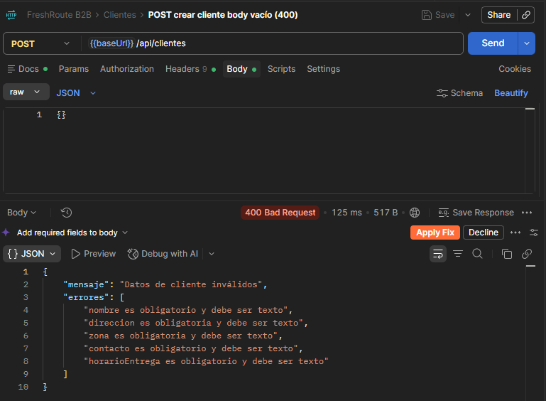

**Módulo Pedidos**

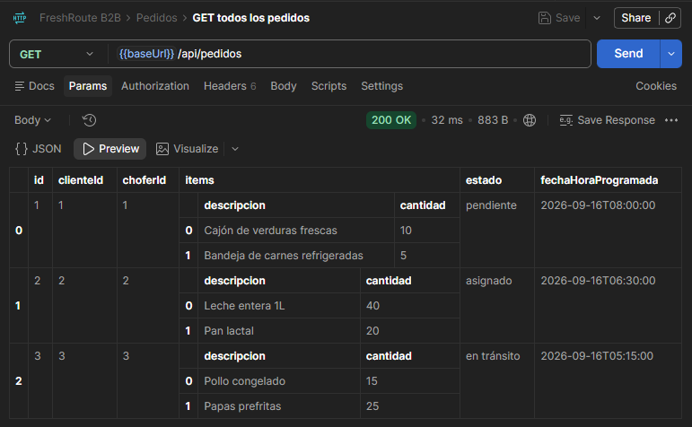

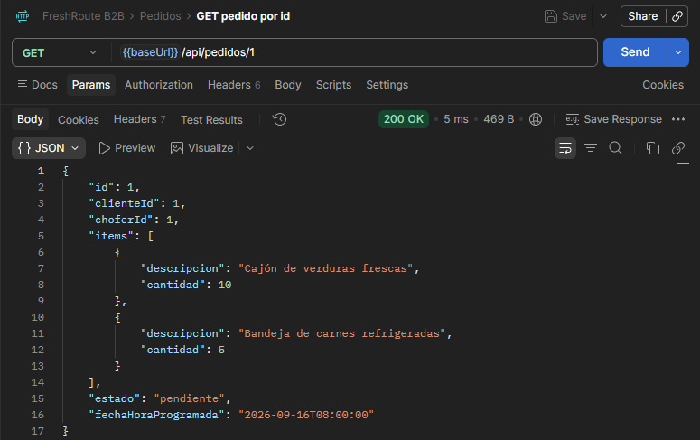

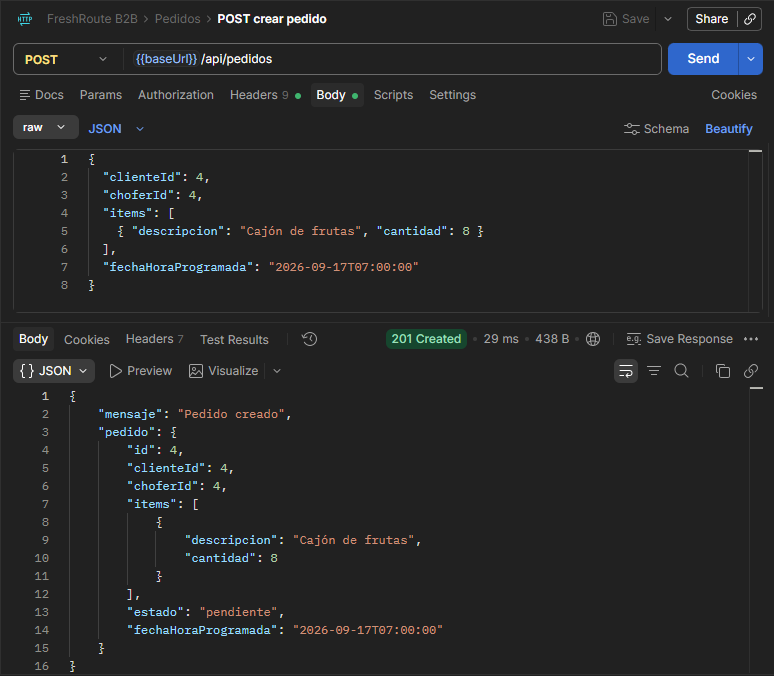

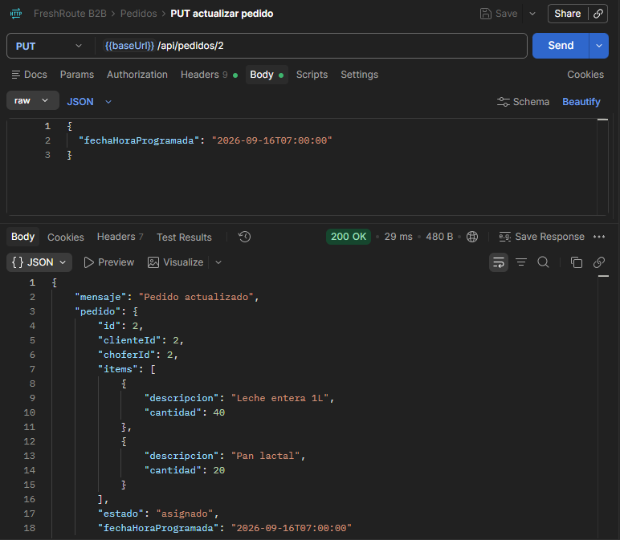

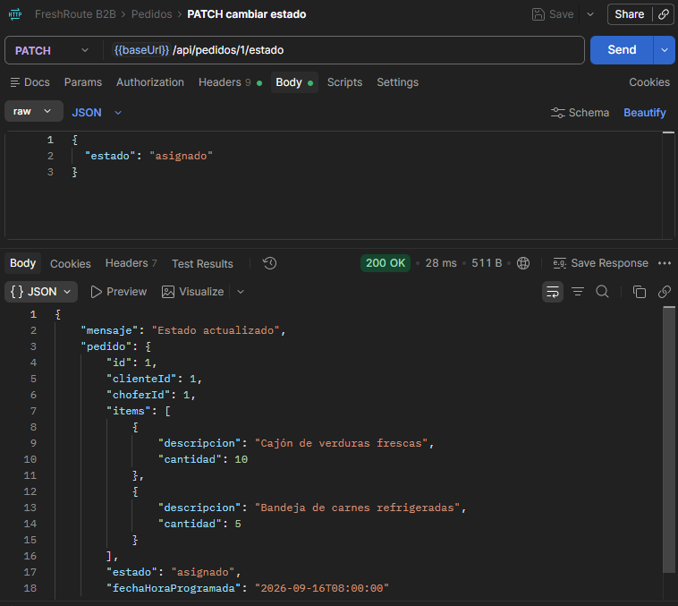

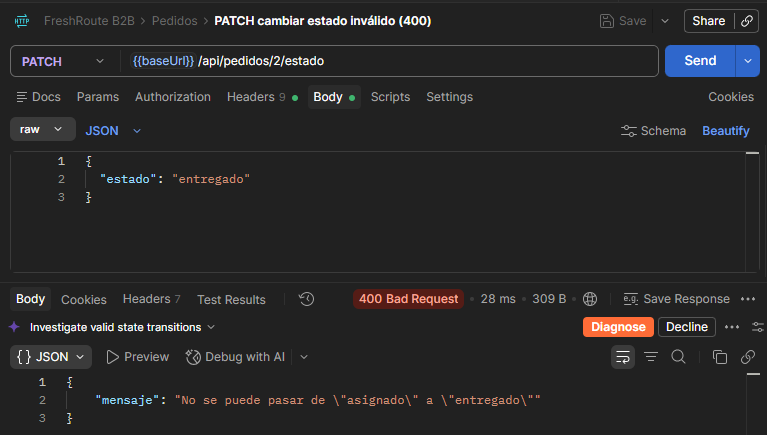

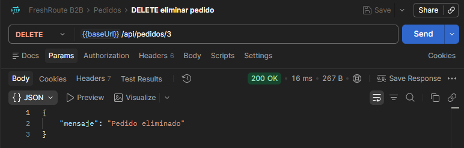

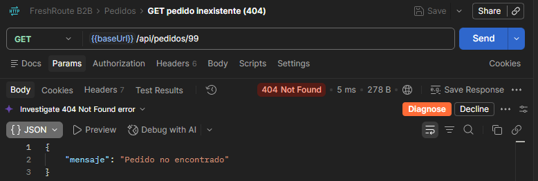

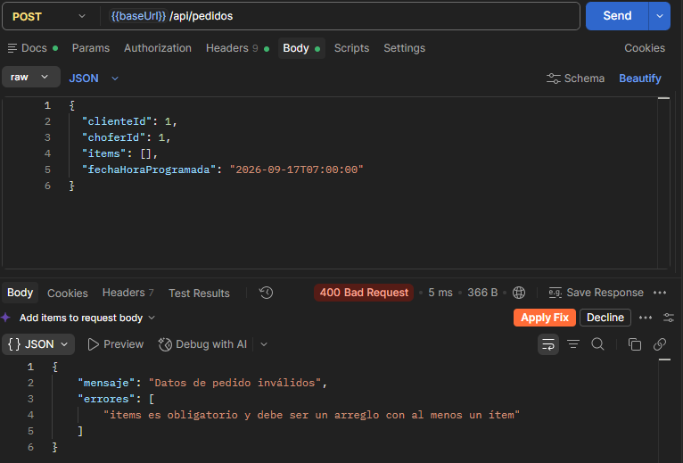

**Choferes (solo lectura)**

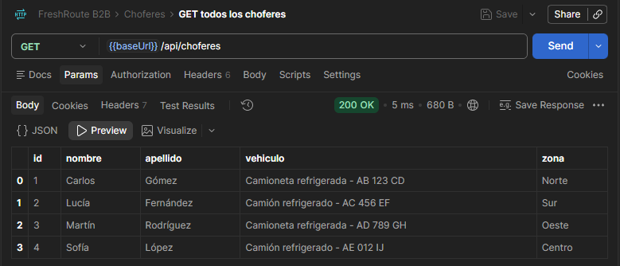

**Manejo de errores**

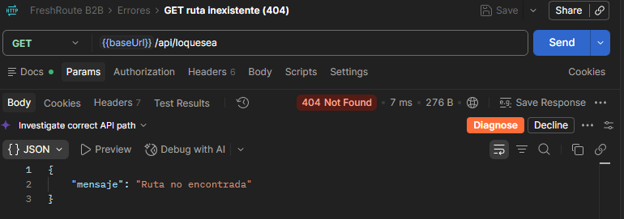
